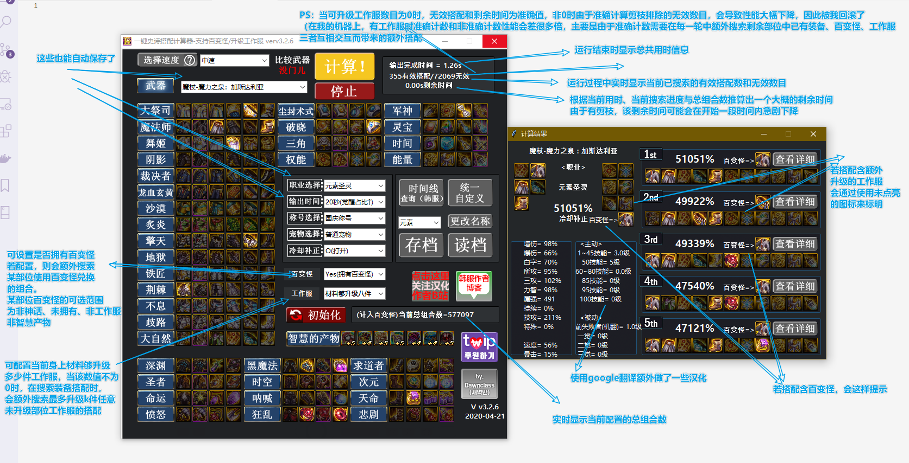
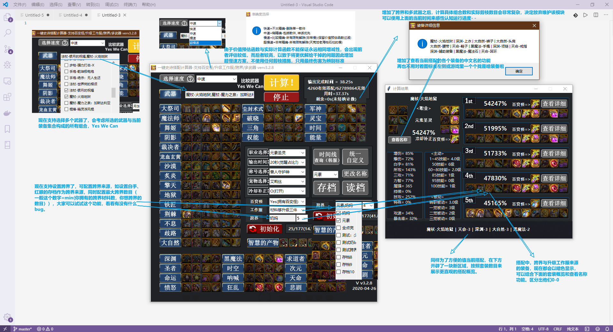

# 前言
本计算器基于[韩服dawnclass-黎明工作室](https://blog.naver.com/PostView.nhn?blogId=dawnclass16&logNo=221931875095#)所写计算器v2.3.1、[韩械](https://space.bilibili.com/4952736)汉化并加入国服特色的一键史诗搭配计算器，在其上进行了一些性能优化、扩展功能、易用性改动及bugfix。

目前实现了搜索百变怪、升级工作服、跨界、多武器搭配等功能，并对启动和搜索性能做了一定优化，在操作易用性上加了一些调整。具体改动内容可见下文

# 韩服黎明工作室原版v2.4.0（更新于2020/4/27)
## 源码发布
https://blog.naver.com/PostView.nhn?blogId=dawnclass16&logNo=221931875095#
## 二进制发布
https://drive.google.com/file/d/1p8ZdzW_NzGKHHOtfPTuZSr1YgSEVtYCj/view

# 网盘链接（更新于2020/4/28)
链接:https://pan.baidu.com/s/1-I8pMK6_yPH5qU4SWNMVog
提取码:238m

# 使用简介
## 第一批功能说明

## 第二批功能说明

## 第三批功能说明

# v3.4.2 2020.5.11
1. 解决因特色加成的额外技攻没有在计算时赋值到skiper中而导致该特色未生效的问题

# v3.4.1 2020.5.11
## 易用性改动
1. 配置文件和配置表支持动态加载

## 数据配置
1. 其他特色可以配置公共的特色，如冒险团和公会属性，这样就不用每个角色都重复配置一遍了
2. 奶系职业的初始体精和智力改用config.toml进行配置

## 其他改动
1. 使用logging模块来进行日志输出，方便排查错误
2. <_<增加恰饭图片哈哈哈哈哈哈

# v3.4 2020.5.10
## 前言
本版本的数据改动较大，如果要使用，建议按照下面的操作将自定义属性中相关数值清空，并在setting/account_other_bonus_attributes.yaml中
按照示例增加对应角色的实际国服特色属性。如果不填的话，这个版本会无法使用（完全不准，因为新版本默认数据表中没有附加的国服特色，自定义
属性中的国服特色相关配置也都移到对应配置表中了）

## 新版国服特色示例
1. 以本人的奶妈、召唤为示例,添加其他国服特色示例,并增加一些新的特色词条
2. 移除加在武器上面的国服特色
    2.1. 力智+500
    2.2. 三攻+200
    2.3. 攻击时，附加8%的伤害
    2.4. 最终伤害+3%
    2.5. 50级主动+3
3. 干掉自定义属性中的一些属性（现已可通过自定义国服特色来实现）
    3.1 奶量增幅的所有数值可以减为0了
    3.2 属强提升中的技能属强、其他属强、勋章属强也可以干掉了
    3.3. 初始属强改为19
4. 调整奶妈的初始智力

## bugfix
1. 解决奶的buflvl表读取偏移了的问题

## ui优化
1. 处理奶的展示界面中一觉被动部分未汉化的问题
2. 解决当奶系职业展示界面右侧五个搭配中有搭配没有百变怪时，切换到其他标准后，若该位置有百变怪，切回原标准后，这个位置的百变怪仍在那里的问题
3. 尝试在结果界面中增加奶妈奶萝的站街面板（不一定准）
4. 加上一个预估的伤害值（不一定准）
    4.1 如果不想显示预估的打桩数据，可以通过配置取消
    4.2 可自行配置分数与打桩的比例关系，从而更加适应自己的角色的打桩数据（目前暂时认为分数与打桩结果是线性相关的）

# v3.3 2020.5.5
## 重构
1. 重构国服特色的实现方式，实现完全配置驱动。用户可以自行通过修改配置表来实现增减国服特色了。
1.1 将原先写死在脚本中的各个国服特色属性改为使用配置表来填写，具体可见setting目录下的各个配置表
1.1.1 setting/styles.yaml 称号的配置表，若需新增称号，可以自行按照现有示例和表头填写规则自行添加，下次启动时将自动出现在称号列表中
1.1.2 setting/creatures.yaml 宠物的配置表，若需新增宠物，可以自行按照现有示例和表头填写规则自行添加，下次启动时将自动出现在宠物列表中
1.1.3 setting/account_other_bonus_attributes.yaml 其余国服特色的配置表，配置方式与上面俩几乎一致，只是names的含义不再是特色的名称，而是存档的名字。
        程序计算时，会从这里面尝试找到当前存档对应的特色列表，并加成到角色属性中。
        可以参照现有注释，每个存档建立一个条目，然后在该条目的entries下按照各个特色，分别把对应词条加进去，如技能宝珠的1-50技能+1、力智+75这种可以用现有词条来表达
        如果有不能表达的词条，建议在贴吧帖子中告知，我在后续添加支持即可。
1.2 程序侧将特色的各个词条抽象出来，供配置表自行配置。并将其映射为输出职业和奶系职业的各个属性，从而实现特色词条到角色属性的转换。
1.3 实际计算特色加成时，根据特色类别和选用的特色，去配置表中找到对应条目进行应用，若使用python直接运行，会在console中看到实际应用的词条和对应属性
2. 在新版的国服特色架构下，奶系也可以享受到特色加成。

## 添加国服特色
1. 增加弓小弦、甜小鱼心悦宠物

## ui优化
1. 展示概览时，按次数多的在前面，其次套装序号小的在前面的规则排列，保证顺序一致
2. 调整show name 中的顺序，将为了优化神话部位搜索顺序而调整顺序的装备序列改回正常顺序再展示
3. 增加更多国服特色配置的引导按钮
4. 当用户取消更新时弹出提示如何关闭检查更新的方法

## 易用性改动
1. 增加配置项 是否检查更新，默认启用，这样用户可以自行选择是否每次启动时检查更新

## 汉化
1. 将奶系职业装备词条名称改为游戏内显示的词条名
2. 增加奶系职业的下标说明
3. 调整奶系职业计算过程的各种变量的名称，使其更加容易阅读
4. 在sheet1中额外注释buflvl中各个行的含义

## 其他改动
1. 增加打印有哪些特色，生效什么词条，对应职业哪些属性
2. 应韩械要求，将原作者的工作室和博客名放到标题上

# v3.2.9.1 2020.5.3
## bugfix
1. 心悦宠物忘记加到宠物列表中了，虽然实际逻辑分支已经加了= =

# v3.2.9 2020.5.3
## 新增功能
1. 增加可通过配置来启用导出任意个排行结果到excel文件的功能 @撒打算多万 以及另一个找不到了网友建议的增加结果界面的数目（ui太麻烦了，就用这个替代吧）
    新版本中增加了config.toml，其中增加了导出excel相关的配置，默认关闭，如果有需求，可以将enable的值设为true，调整导出名和导出数目，即可体验该功能
2. 增加读取配置功能

## 代码调整
1. 调整查找版本号的正则，使其更健壮

# v3.2.8.3 2020.5.2
## bugfix
1. 阳剑技攻调为59.9=（1.30*1.23)-1
2. 经多名贴吧网友反馈，歧路、不息、裁决者等装备属性异常高。经排查，由于之前保存自定义中调整装备属性时，装备的行号是写死的，导致调整装备顺序、
    位置或新增装备时，可能对应保存地方与预期不一致。改为在启动时预先获取各个装备编码对应的行号，在需要特别定位某个装备时，通过装备编码来获取对应行号。
3. 普雷魔法石与辅助装备的图标反了，@-最皮吧友
4. 修复增加青沙棍后，之后的武器id都增1，但buf表中奶系的武器的id没有调整（仍为111040-111043），导致前三把武器实际数据后后三把，而最后一把则找不到对应数据 @Johnny丶Qian
5. 拥有军神耳环，且不拥有军神辅助装备，需要减去10%力智加成 @本子导致羊尾
6. 调整宠物技能10%增伤的实现，因为是直接乘算最终伤害的，又因为一般队友也有，所以一般能全程迟到，所以改为当做10%技攻

## ui优化
1. 调整各个窗口的大小与位置 @Nirvana_Ch
2. 对齐和优化自定义界面 @Nirvana_Ch
3. 大恍惚增幅范围改为0-13 @Nirvana_Ch
4. 调整存档数为100个，并调整额外存档数据的存盘区域以适应新的存档数目，同时增加对旧版存档数据的兼容处理
5. 调整更改存档名的流程，直接在存档名文本框中修改，然后点击存档即可

## 使用便利性
1. 在读档A后，切换其他存档B，然后误点存档并确认后用存档B把存档A给覆盖这种情况时，额外弹出一个确认框，提示，用户可以自行确定是否真想这么做
2. 启动时增加检查更新功能，若有更新会提示是否更新，确认后会弹出网盘页面，并弹窗告知提取码

## 其他改动
1. 调整主窗口标题
2. 特殊成套装备在不成套时减掉属性的处理加上注释
3. 增加心悦宠物 @老贺最

# v3.2.8.2 2020.4.30
## bugfix
1. 经贴吧网友@王八老二 反馈，魔改后版本的神话装备图片没有原来那么闪，并给出了对比图，经排查发现作者在images目录中神话装备会有三个文件，
    分别是以n.gif/n.png/f.png结尾，对应超闪耀，点亮、暗淡三种，实际上原版神话装备只用了1和3，但是优化加载图片时是改为文件夹中有多少个图片就按需加载，
    由于前俩的key都是装备编码，而且超闪亮的是先加载的，所以会被普通闪给覆盖。目前已修复
2. 经贴吧多名网友反馈，奶系职业无法使用也与黑瞳武器，经排查发现原版数据表中夜语黑瞳武器为111001，韩械魔改后为111014，而没在buf表中同步，已修复
3. 经贴吧网友@阿飘 反馈，太极天帝剑（阳）攻速不对，应为-50%，实际写成了20%，同时修复了顺带发现的太极天帝剑技能攻击力不对的问题，应为53%（30+23），而不是60%
    3.1 经贴吧网友@划圆为牢 反馈，天帝剑的技攻是乘算的，1.30*1.23=1.599 约等于60技攻的提升，改回去= =
4. 百变怪不能转化为传说、普雷
5. 多名网友反馈希望不要默认将普雷传说加入备选池，考虑到两种方案都有一定需求，增加配置项：是否默认将普雷传说装备加入备选池
6. 经贴吧网友@～Smile 反馈，增加不优先神话的中速方案，选择该方案时，神话装备与普通装备具有相同的优先级

## 数据改动
1. 应多位贴吧网友要求，增加了2019升级版至尊年宠 '神迹·古国英豪莱恩', '神迹·太初之音薇泽达'
2. 经贴吧网友建议，将宠物技能的3.3%期望伤害改为最终伤害，因为这个技能是直接最后加成上去的
3. 为了方便日后改动，借助谷歌翻译和对照游戏内的装备数据，在上周汉化Data.xlsx中one sheet的基础上将全部表格汉化了

## 易用性改动
1. 调整武器顺序，将顺序改为韩服作者原先的顺序，方便大家找武器
2. 发现原版中的青沙棍在韩械增加普雷武器时被替换成普雷武器了，现已加回来
3. 按照游戏中冒险团页面角色收藏簿的顺序重新排列职业，方便查找，并将奶妈、奶萝、奶爸改回原来的名字并放到对应位置（强迫症），将其他角色的名称调成与游戏中一致，如男女鬼剑，铁血统帅，并在读取存档时针对职业名称变化，增加兼容处理

## 其他改动
1. 加入百度网盘的地址，方便大家查找下载二进制
2. 增加韩服4.27发布的最新版2.4.0源码与相关发布页面，并在readme文件中增加韩服原作者与韩械的链接

# v3.2.8.1 2020.4.26
## bugfix:
1. 经贴吧网友@反正有大好时光 @Usingaa @丿俊哥丶，新版本中自定义功能出现问题，经排查定位到是因为多增加了一行列名含义后，保存自定义结构的代码中写死的坐标会找到错误的定位，已修复
2. 经贴吧网友@罗衣 @git，奶系选择百变怪后计算有时候会卡住，经排查发现是因为写法与输出那边不太一样，导致相同的处理办法直接拷贝过来会有问题，已修复
3. 发现新加的套装概览区域不会随查看详细信息和更改奶量标准变动，查了下，发现是做的时候太忙了，忘记了。。。已修复

## 开发工具
1. 新增脚本_export_excel_to_txt.py，用于将data.xlsx与preset.xlsx导出为文本格式，方便进行版本对比，避免误改动到数据文件

# v3.2.8 2020.4.26
## 新增功能
1. 增加装备跨界功能，因计数部分太复杂，不再维护
2. 增加选择多个武器的功能，因计数部分太复杂，不再维护
3. 增加区域展示更加方便阅读的当前搭配，如天擎3水果2这种
4. 结果栏中增加查看名称按钮，点击即可查看当前搭配的各部位装备名称，不用再看图认出装备了
5. 增加当前用时，方便看花了多少时间了
6. 在显示当前组合数的地方，在前面加上装备的收集进度
7. 把结果界面的层级不设置最顶端，这样出结果后切换其他角色时不需要额外折腾
8. 增加多选列表组件
9. 增加与贝奇邂逅称号（因为我的奶妈在用这个<_<)
10. 汉化data.xlsx
11. Data.xlsx增加首行，表示各列的中文含义，同时冻结第一行与前两列，这样编辑具体数值时容易定位

## bugfix
1. 根据b站网友@面粉馅包子 的反馈，之前版本的百变怪功能在特定装备级下，百变怪没有选择最合适的转换装备。
    经排查发现，是因为作者根据搭配套装数目预估价值量的函数f=sum([floor(x * 0.7) for x in set_val.values()]) + god,
    与其实际精确搭配的奶量伤害的函数g，不能满足在任意区间内都具有相同的函数单调性（递增或递减），
    从而可能或出现对于某些搭配x1,x2，f（x1）<f(x2)，而g(x1)>g（x2），在作者的原剪枝流程中，会导致x1搭配被视为无效搭配。

    解决办法：
    1. （非常耗时）计算每个搭配的精确伤害奶量来找到在该伤害奶量算法下的精确解
    2. （实现难度高）找到更合适的价值评估函数，在满足与该伤害奶量算法相同增减性的同时，且计算代价小
    3. （自行选择精确度还是速度）仍使用当前算法，忍受为了计算速度而可能错过一些精确解的bug，
        与此同时，增加超慢速选项，允许用户选择使用花费更多时间来得到更精确的解。
        但是这种情况下，由于无法进行提前剪枝，需要计算所有组合，其时间复杂度将是O(n1*n2*...n10*n11)，
        其中ni为部位i的可选装备数目，在各部位都有一定数目的情况下，用时将难以想象

    出于个人精力有限，目前暂时选择方案3，在速度选项再增加一个超慢速方案，当选择该方案时，所有剪枝与预判都会停用，对比装备的唯一标准
    就是作者实际计算伤害奶量的算法结果

    排查过程截图详见网盘或贴吧帖子
2. 经韩械反馈，属强多出来了80点，应该是之前他在data.xlsx中补正的数值我这边重新计算了一遍- -，暂时先在国服特色的函数中减去一定数值，保证两边属强计算结果一样
3. 经贴吧网友@飞花逐月反馈，在五个散件防具、两首饰、两特殊这种类似的情况下，原版只会给出唯一的史诗组成的搭配，而略过了实际战力更高的传说普雷搭配。
   为了计算结果更精确，永远将100传说防具、普雷首饰、普雷特殊加入备选方案
4. 经贴吧网友@萌萌的汉堡包反馈，在特定组合下选择百变怪计算奶量时程序会无法计算，提示时间很长，经排查，是之前遇到过的一个bug，只是修复了输出职业的那边，奶这边没有改。
   具体原因：目前select是默认初始化时将tg{1101-3336}[0,1]范围的key对应的值都设为0，而百变怪会根据select的值为0来筛选出未选择的集合，
   因此在获取装备属性切片时，如果因为这件装备时间不存在，导致切片为None而空指针访问程序无法正常执行。这种情况，直接判断空指针返回就可以了

# v3.2.7.2 2020.4.23
1. 经韩械反馈，原先版本已经实现了至尊宠物所带来的5%最终伤害，一级1-50级技能+1，只不过实现方式是在Data.xlsx中所有武器的这两个属性中分别加了相应值，
    因此，3.2.7版本的最终伤害会高5%，1-50级技能等级会多出1点来
    根据他的建议，目前从Data.xlsx中移除了这两个加成，并在那边的另一个1-50级技能+1（暂不明确来源）加到国服特色的代码中

# v3.2.7.1 2020.4.23
1. 经贴吧吧友@给QQ一巴掌 提示，发现在调整国服特色数值实现的过程中，把原有的初始属强给漏了，这里给补回来

# v3.2.7 2020.4.21
1. 增加支持更多春节宠物、称号和国庆称号，并尽可能将每个词条都考虑进来
2. 修复夜语黑瞳武器55技攻变成55速度的问题
3. 修复update_count和update_count2在tkinter.mainloop启动前就调用tkinter相关组件而导致计算倒计时的功能挂掉的bug
4. 增加每个词条的枚举，而不是使用magic number来访问- -
5. 汉化data中的部分装备名称

# v3.2.6 2020.4.20
1. 百变怪的备选集合中排除升级得到的工作服、智慧产物
2. 新增可配置最多升级n件工作服的功能
3. 目前select是默认初始化时将tg{1101-3336}[0,1]范围的key对应的值都设为0，而百变怪会根据select的值为0来筛选出未选择的集合，因此在这里如果为None，将其过滤掉，避免程序不运行
    3.1 bug来源：@我就水亿贴 贴吧网友的反馈
4. ui细节调整
5. 增加推荐使用步骤及免责声明
6. 增加一件发布脚本
7. 增加加入升级工作服功能后，剪枝时的精确计数，后因性能问题回滚

# v3.2.5 2020.4.20
1. 修复奶系职业切换排序标准时右侧搭配不刷新的问题
2. 输出结果界面额外汉化
3. 输出界面排版优化

# v3.2.4 2020.4.19
1. 将保存结果的结构体由列表改为最小堆（存储O(n)，排行O(1)），原先的排行消耗太大(存储O(n*logn),排行O(n^2))，尤其是在点亮全部装备的时候尤为显著

# v3.2.3 2019.4.19
1. 修复状态栏中剪枝时未计入后续组合中的百变怪的组合而导致算的增加的无效组合数低于实际剪枝数目
2. 修复下方统计总数时因将神话装备算入百变怪备选集合而导致总数与上方计得数字不一致的问题
3. 添加无提前剪枝和最宽泛上限的剪枝方案
3.1 测试数据无提前剪枝用时123s
3.2 测试数据最宽泛上限剪枝用时9s
3.2.1 每个剩余装备按1点增益计算，若目前序列尚无神话，且后续序列存在神话，则额外加一点
3.2 测试数据任意现有装备下新增若干个装备剪枝用时8.99s
3.2.2 当前已有装备不受限制，预先计算任意新增k个装备所能得到的最大增益，若目前序列尚无神话，且后续序列存在神话，则额外加一点

# v3.2.2 2019.4.19
由于下周或者下下周，基本上大部分人的百变怪都做出来了，那时候大家可能会烦恼如何使用计算器来看这个百变怪该选啥，为了不至于一个个去尝试，因此增加了下述功能
1. 将itertools.product改为自行实现，方便在中间过程进行剪枝
2. 增加百变怪功能，当选择拥有百变怪选项时，计算搭配时会将百变怪考虑进来

# v3.2.1 2019.4.14
1. 存档读档功能增加支持选择速度、武器、职业选择、输出时间、称号选择、宠物选择、冷却补正等信息，无需每次读档后再手动设定后才能进行计算，现在读档后可以直接点计算
2. 启动时自动读取首个存档，无需再自己去点一次读档才能去进行其余操作
3. 性能优化：
    3.1. 调整读取装备图片的流程，通过遍历文件夹来实现加载所需的图片，而不是穷举所有可能，最后导致启动时要卡顿两秒，根据测试，目前读取图片共使用0:00:01.780298秒, 总共尝试加载6749个， 有效的加载为351个
    3.2. 国内环境无法访问他那个更新版本的google网盘地址，所以直接移除相关代码
4. 干掉了在总组合数目超过5亿种时不允许玩家运行的限制，同时将遍历组合的流程由先生产所有改为使用生成器去遍历，使得在组合数非常大时内存也不会溢出，经测试即时点亮所有图标，新版本也能够正常计算
5. 增加计算预计剩余时间的功能，在计算栏中将初始化右侧已显示的当前总组合数移除，改为预计剩余计算时间，这样可以更容易知道进度
6. 初始状态设为停止状态，在成功开始计算时设为计算状态，结束计算时和按停止时设为停止状态
7. 保证职业列表按照excel表中的行顺序排列
8. 未选择职业或武器直接点计算时弹出错误框，使得更加易用
